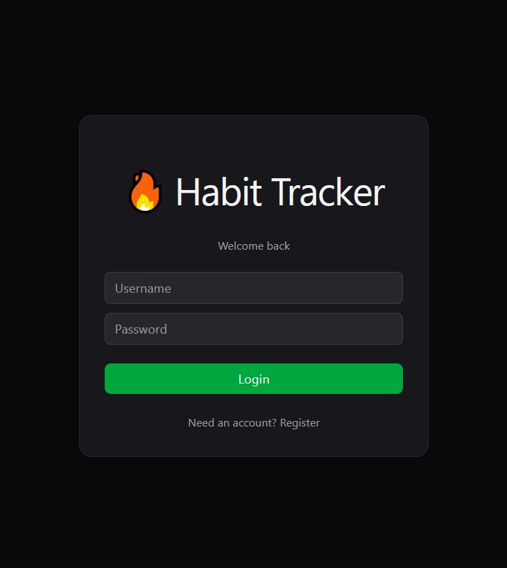
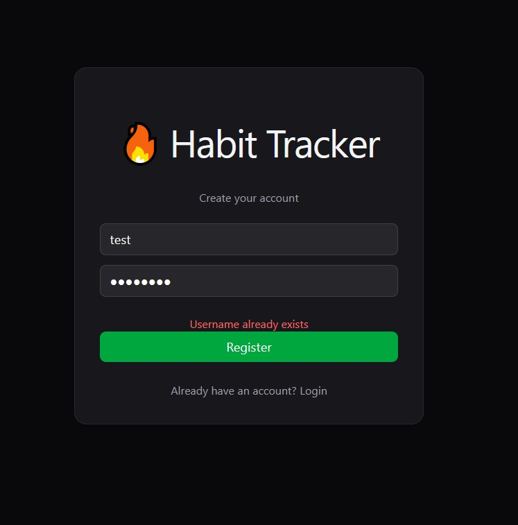
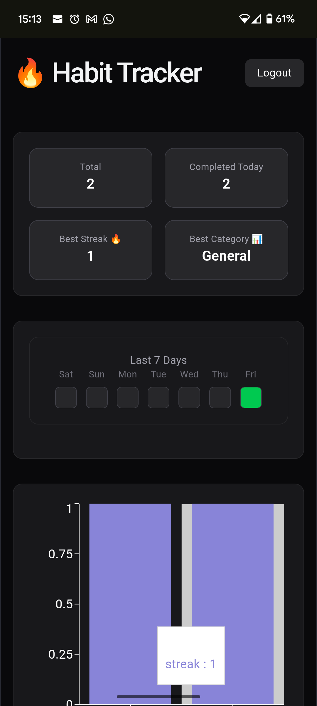
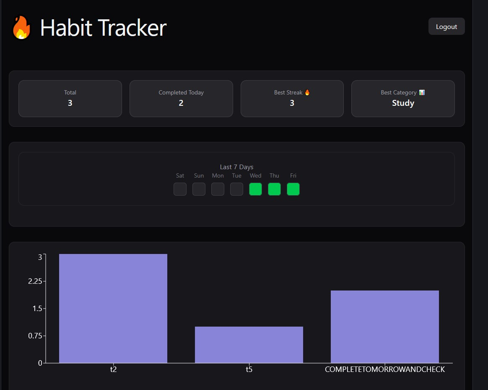
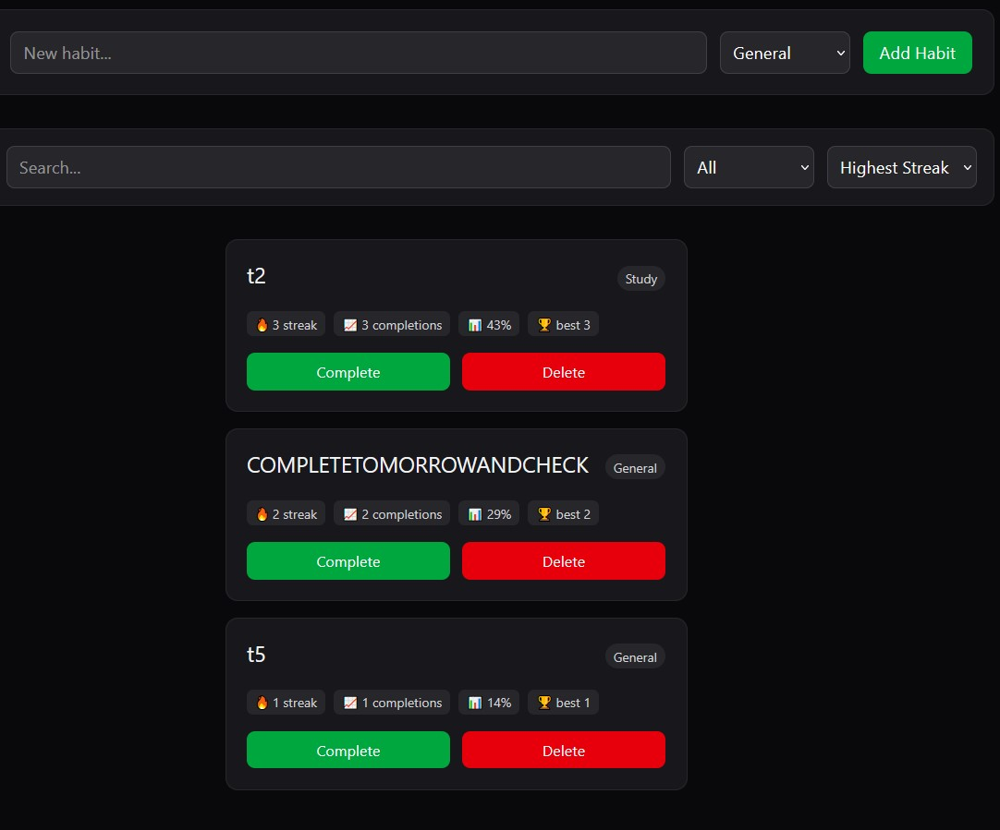
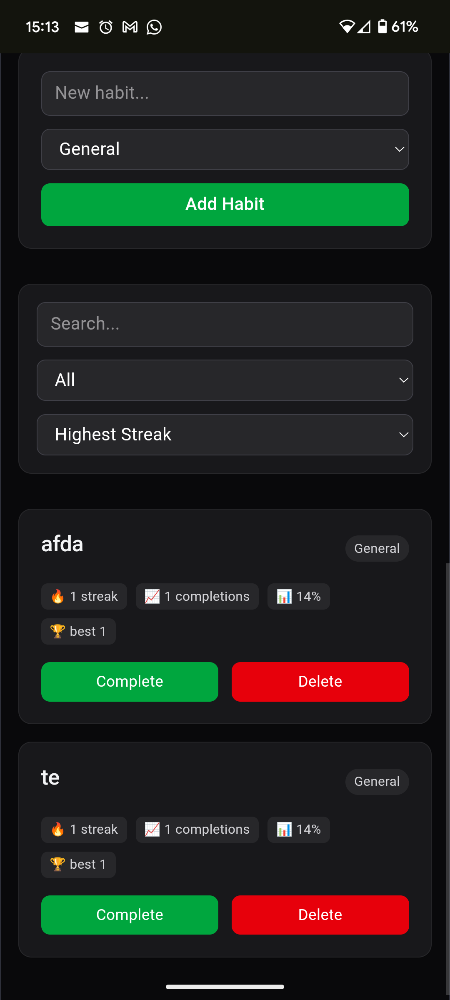

# 🧠 Habit Tracker (Full-Stack App)

A simple full-stack habit tracking application built with **React (TypeScript)** frontend and **.NET 8 Web API** backend using **SQLite** for persistence.

---

## 🚀 Features

### 🔐 Authentication System
- User registration and login
- JWT-based authentication
- Persistent login using localStorage
- Protected API routes

---

### 📊 Habit Tracking
- Create habits with categories
- Mark habits as complete
- Delete habits
- Track streaks per habit
- Filter and sort habits (streak-based, category-based)

---

### 📈 Analytics Dashboard
- Total habits counter
- Completed habits today
- Best streak tracking
- Best performing category detection
- Completion rate per habit
- Longest streak calculation

---

### 📉 Data Visualization
- Habit streak bar chart (Recharts)
- 7-day activity heatmap
- Real-time UI updates after actions

---

### 🎨 UI / UX Improvements
- Dark mode dashboard UI (Zinc theme)
- Tailwind CSS component styling system
- Card-based layout design
- Responsive layout (mobile + desktop)
- Hover states and smooth transitions
- Centered dashboard container system

---

### 🔔 User Experience Enhancements
- Toast notifications using `react-hot-toast`:
  - Habit completed 🔥
  - Habit deleted 🗑
  - Login success 👋
  - Registration success 🎉
- Instant UI updates after API actions

---


## 🧱 Tech Stack

### Frontend
- React
- TypeScript
- Vite
- Tailwind CSS
- Fetch API
- Recharts
- React Hot Toast

### Backend
- ASP.NET Core Web API (.NET 8)
- Entity Framework Core
- SQLite
- JWT Authentication

---

## 📸 Screenshots

### Login Page




### Dashboard






---

## 🌐 Deployment

Deployed to http://87.106.201.20
For a live demo.

---

## ⚙️ Project Structure
HabitTracker/
├── habittracker-frontend/ # React frontend
│ ├── src/components/
│ │ ├── habits/
│ │ ├── dashboard/
│ │ └── auth/
│ ├── src/api/
│ ├── src/types/
│ └── App.tsx
│
└── HabitTrackerAPI/ # .NET backend
---

## 🔧 Setup Instructions

### 1. Clone the repository

```bash
git clone https://github.com/YOUR_USERNAME/habit-tracker.git
cd habit-tracker
```

### 2. Run Backend (.NET API)
```bash
cd HabitTrackerAPI
dotnet restore
dotnet run
```
Backend runs at:
```http://localhost:5016 (or similar)```
Check if this matches in habittracker-frontend/src/api/habitsApi.ts and the BASE_URL in App.tsx otherwise replace the numbers after the : with the ones displayed on the terminal when running the backend.

### 3. Run Frontend (React)
```bash
cd habittracker-frontend
npm install
npm run dev
```
Frontend runs at:
```https://localhost:5173```

### API Endpoints
Authentication
- POST /api/auth/register
- POST /api/auth/login

Habits
- GET /api/habits -> Get all habits
- POST /api/habits -> Create a new habit
- PUT /api/habits/{id}/complete -> Complete a habit
- DELETE /api/habits/{id} -> Delete a habit


## ⭐ Interview Explanation

This project is a full-stack habit tracking application demonstrating REST API design, authentication, and frontend-backend integration using React and ASP.NET Core.

The frontend handles:
- authentication state
- dashboard rendering
- filtering/sorting
- charts and analytics
- responsive UI design

The backend exposes a REST API with JWT authentication and persists user habit data using SQLite and Entity Framework Core.

The application focuses on:
- full client/server integration
- clean component structure
- user-focused dashboard UX
- real-time UI updates
- data visualization
- authenticated API communication

### What I learned
- Building a REST API with ASP.NET Core
- Connecting frontend to backend
- Using Entity Framework Core with SQLite
- Handling CORS in full-stack apps
- Managing state in React
- Full-stack architecture (React + .NET API)
- JWT authentication flow
- State management in React
- Component-based UI design
- Data Visualization with Recharts
- Building production-style UI with Tailwind CSS
- Designing user-focused dashboard UX

## ⚠️ Known Limitations

- No password reset system
- No refresh token rotation
- SQLite used instead of production database
- No containerization (Docker)

### Author
Built by Wahab as a full-stack project.
